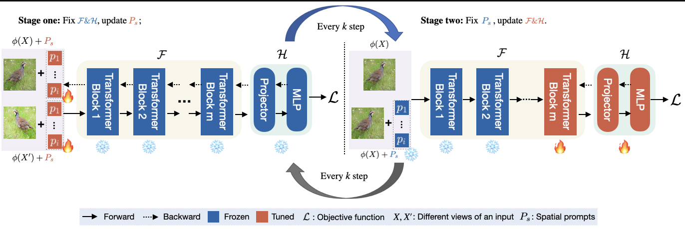

# SPTNet: An Efficient Alternative Framework for Generalized Category Discovery with Spatial Prompt Tuning (ICLR 2024)


<p align="center">
    <a href="https://arxiv.org/abs/2403.13684"></a>
    <a href="https://visual-ai.github.io/sptnet/"></a>
    <a href="#jump"></a>
</p>
<p align="center">
	SPTNet: An Efficient Alternative Framework for Generalized Category Discovery with Spatial Prompt Tuning <br>
  By
  <a href="https://whj363636.github.io/">Hongjun Wang</a>, 
  <a href="https://sgvaze.github.io/">Sagar Vaze</a>, and 
  <a href="https://www.kaihan.org/">Kai Han</a>.
</p>




## Prerequisite 🛠️

First, you need to clone the SPTNet repository from GitHub. Open your terminal and run the following command:

```
git clone https://github.com/Visual-AI/SPTNet.git
cd SPTNet
```

We recommend setting up a conda environment for the project:

```bash
conda create --name=spt python=3.9
conda activate spt
pip install -r requirements.txt
```

## Running 🏃
### Config

Set paths to datasets and desired log directories in ```config.py```


### Datasets

We use generic object recognition datasets, including CIFAR-10/100 and ImageNet-100/1K:

* [CIFAR-10/100](https://pytorch.org/vision/stable/datasets.html) and [ImageNet-100/1K](https://image-net.org/download.php)

We also use fine-grained benchmarks (CUB, Stanford-cars, FGVC-aircraft, Herbarium-19). You can find the datasets in:

* [The Semantic Shift Benchmark (SSB)](https://github.com/sgvaze/osr_closed_set_all_you_need#ssb) and [Herbarium19](https://www.kaggle.com/c/herbarium-2019-fgvc6)

### Checkpoints
Download the checkpints for different datasets and put them in the ``checkpoints'' folder.
* [Google Drive](https://drive.google.com/drive/folders/16O0QvsCuVb9Xd-UJNx3J3n6WVH6B_IHw?usp=drive_link)

### Scripts

**Eval the model**
```
CUDA_VISIBLE_DEVICES=0 python eval.py \
    --dataset_name 'aircraft' \
    --pretrained_model_path ./checkpoints/fgvc/dinoB16_best.pt \
    --prompt_type 'all' \
    --eval_funcs 'v2' \
```
To reproduce all main results in the paper, just change the name (``dataset_name``) and its corresponding path (``pretrained_model_path``) to the pretrained model you downloaded from the above link.

**Train the model**:

```
CUDA_VISIBLE_DEVICES=0 python train_spt.py \
    --dataset_name 'aircraft' \
    --batch_size 128 \
    --grad_from_block 11 \
    --epochs 1000 \
    --num_workers 8 \
    --use_ssb_splits \
    --sup_weight 0.35 \
    --weight_decay 5e-4 \
    --transform 'imagenet' \
    --lr 1 \
    --lr2 0.05 \
    --prompt_size 1 \
    --freq_rep_learn 20 \
    --pretrained_model_path ${YOUR_OWN_PRETRAINED_PATH} \
    --prompt_type 'all' \
    --eval_funcs 'v2' \
    --warmup_teacher_temp 0.07 \
    --teacher_temp 0.04 \
    --warmup_teacher_temp_epochs 10 \
    --memax_weight 1 \
    --model_path ${YOUR_OWN_SAVE_DIR}
```
Just be aware to change the name (``dataset_name``) and its corresponding path (``pretrained_model_path``) to the pretrained model. Our SPTNet method is adaptable to various pretrained models, allowing for the modification of the architecture by changing the ``pretrained_model_path``. This feature enables quick adoption of the state-of-the-art (SOTA) method. Our default settings utilize the SimGCD method.


## Results
Generic results:
|              | All  | Old  | New  |
|--------------|------|------|------|
| CIFAR-10     | 97.3 | 95.0 | 98.6 |
| CIFAR-100    | 81.3 | 84.3 | 75.6 |
| ImageNet-100 | 85.4 | 93.2 | 81.4 |

Fine-grained results:
|               | All  | Old  | New  |
|---------------|------|------|------|
| CUB           | 65.8 | 68.8 | 65.1 |
| Stanford Cars | 59.0 | 79.2 | 49.3 |
| FGVC-Aircraft | 59.3 | 61.8 | 58.1 |
| Herbarium19   | 43.4 | 58.7 | 35.2 |


## Citing this work
<span id="jump"></span>
If you find this repo useful for your research, please consider citing our paper:

```
@inproceedings{wang2024sptnet,
    author    = {Wang, Hongjun and Vaze, Sagar and Han, Kai},
    title     = {SPTNet: An Efficient Alternative Framework for Generalized Category Discovery with Spatial Prompt Tuning},
    booktitle = {International Conference on Learning Representations (ICLR)},
    year      = {2024}
}
```
